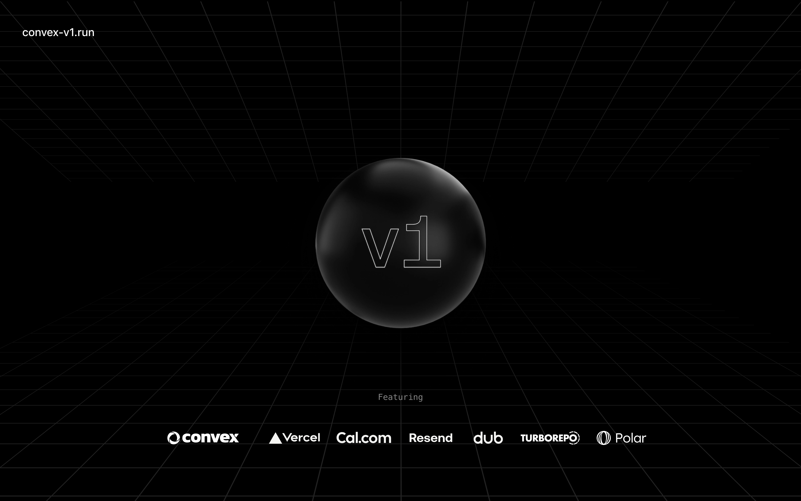

<p align="center">
	<h1 align="center"><b>Ollalink</b></h1>
<p align="center">
    A multi-tenant operations platform for remote device management, background jobs, and audit trails.
    Built with <a href="https://nextjs.org">Next.js</a> and <a href="https://convex.dev">Convex</a>.
    <br />
    <br />
    <a href="https://ollalink.io"><strong>Website</strong></a> ·
    <a href="https://github.com/ollalink/ollalink/issues"><strong>Issues</strong></a> ·
    <a href="#whats-included"><strong>What's included</strong></a> ·
    <a href="#prerequisites"><strong>Prerequisites</strong></a> ·
    <a href="#getting-started"><strong>Getting Started</strong></a> ·
    <a href="#deployment"><strong>Deploying to Production</strong></a>
  </p>
</p>

Ollalink gives you everything you need to operate a distributed team: multi-tenant workspaces,
remote device agents, durable background jobs, file storage, audit logging, and billing — in an
opinionated monorepo that grows with your business.

> **Note:** This project evolved from the <a href="https://v1.run">v1</a> starter kit by
> <a href="https://midday.ai">Midday</a>, ported to Convex. It is now being developed as
> Ollalink.

## What's included

[Convex](https://convex.dev/) - Authentication, database, storage, background jobs, validated server actions, cache, rate limiting<br>
[Next.js](https://nextjs.org/) - Framework<br>
[Turborepo](https://turbo.build) - Build system<br>
[Biome](https://biomejs.dev) - Linter, formatter<br>
[TailwindCSS](https://tailwindcss.com/) - Styling<br>
[Shadcn](https://ui.shadcn.com/) - UI components<br>
[TypeScript](https://www.typescriptlang.org/) - Type safety<br>
[React Email](https://react.email/) - Email templates<br>
[Resend](https://resend.com/) - Email delivery<br>
[i18n](https://next-international.vercel.app/) - Internationalization<br>
[Sentry](https://sentry.io/) - Error handling/monitoring<br>
[OpenPanel](https://openpanel.dev/) - Analytics<br>
[Polar](https://polar.sh) - Billing<br>
[nuqs](https://nuqs.47ng.com/) - Type-safe search params state manager<br>
[next-themes](https://next-themes-example.vercel.app/) - Theme manager<br>

## Directory Structure

> See [`ARCHITECTURE.md`](./ARCHITECTURE.md) for the full codebase map, data
> flow, and per-package details. See [`ENV.md`](./ENV.md) for all env vars.

```
.
├── frontend/                    # 🖥️  Frontend apps (workspace: frontend/*)
│    ├── dashboard               # @v1/app  — Next.js dashboard (port 3000)
│    └── marketing              # @v1/web  — Next.js marketing site (port 3001)
├── backend/                     # ⚙️  Backend services (workspace: backend/*)
│    ├── convex                  # @v1/backend — Convex (API, Auth, DB, Jobs, JWKS, Billing)
│    ├── relay                   # @v1/relay — WebSocket relay for WebRTC (port 8080)
│    └── reference-api          # Reference external backend (Node, :4000)
├── shared/                      # 📦  Shared libraries (workspace: shared/*)
│    ├── ui                      # Shared UI components (Shadcn/Radix)
│    ├── email                   # React Email templates
│    ├── analytics               # OpenPanel analytics (client/server/events)
│    ├── logger                  # pino logger
│    └── tooling-typescript      # Shared tsconfig bases (base/nextjs/react-library)
├── windows-agent                # Electron desktop agent (active Windows agent)
├── deploy                        # Numbered bash deployment runbook (01–53)
│    └── helpers                 # Standalone one-off / diagnostic scripts
├── e2e                          # Playwright + adversarial security suites
├── scripts                      # Root-level one-off dev/utility scripts
├── self-hosted                  # docker-compose for GlitchTip + Mailpit
├── archive                       # Reference-only snapshots (NOT in workspace)
│    ├── agent-win-archive       # Original Rust Windows agent (non-functional)
│    └── convex-ready-template-main # Archived upstream template
├── biome.json                   # Biome configuration (lint/format)
├── turbo.json                   # Turbo configuration
├── project.config.ts            # Central project config (host, ports, backend)
├── ARCHITECTURE.md              # Full codebase map
├── ENV.md                       # Environment variables reference
├── ROADMAP.md / session.md
├── LICENSE
└── README.md
```

> **Where is…?** Frontend → `frontend/` · Backend → `backend/` · Shared → `shared/`

## Prerequisites

### Bun

Bun is the only prerequisite you need to install before getting started.

To install Bun, please follow the official installation instructions:

[Bun Installation Guide](https://bun.sh/docs/installation)


## Getting Started

You can set up Ollalink locally with Bun and a Convex backend.

### Clone the repository

```bash
git clone https://github.com/ollalink/ollalink.git
cd ollalink
```

### Install dependencies

```bash
bun install
```

### Set up environment variables

Copy the example environment files and fill in your values. See [`ENV.md`](./ENV.md)
for the full list per package.

```bash
cp frontend/dashboard/.env.example frontend/dashboard/.env.local
cp frontend/marketing/.env.example frontend/marketing/.env.local
cp backend/relay/.env.example backend/relay/.env
# Convex backend vars are set on the dashboard or via `convex env set`:
#   see backend/convex/.env.example
```

### Configure Convex

Set up your Convex project and deploy the schema:

```bash
npx convex dev
```

### Run the apps

```bash
bun dev
```

Open [http://localhost:3000](http://localhost:3000) for the marketing site and [http://localhost:3001](http://localhost:3001) for the dashboard (ports may vary).

```bash
cd your-project-name
bun dev
```

### Option 2: Manual Setup

If you prefer to set up the project manually, follow these steps:

1. Clone the repository:
   ```bash
   bunx degit get-convex/v1 v1
   cd v1
   ```

2. Install dependencies:
   ```bash
   bun install
   ```

3. Initialize git repository:
   ```bash
   git init && git commit -am 'initial commit'
   ```

4. Set up Convex backend:
   ```bash
   cd packages/backend
   npm run setup
   ```
   This will create a new Convex project. It will fail after project creation due to missing environment variables, which is expected at this stage.

5. Set up authentication:
   ```bash
   npx @convex-dev/auth
   ```
   Follow the prompts to configure authentication for your project.

6. Set up environment variables:
   If you prefer to set up services manually or want more control over the process, refer to the [Detailed Service Setup Instructions](#detailed-service-setup-instructions) section below.

7. Copy Convex environment variables:
   - Copy the contents of `packages/backend/.env`
   - Paste these variables into the environment variables panel in your Convex
     dashboard

8. Initialize Polar products and seed database:
   ```bash
   cd packages/backend
   bunx convex run init
   ```

9. Start the development server:
   ```bash
   bun dev
   ```
   This starts everything in development mode (web, app, api, email).

   Alternatively, you can start specific parts of the application:
   - `bun dev:web`: starts the web app
   - `bun dev:app`: starts the app
   - `bun dev:convex`: starts the Convex API
   - `bun dev:email`: starts the email app

## Detailed Service Setup Instructions

<details>
<summary>Click to expand detailed setup instructions</summary>

If you choose to manually set up services and environment variables, follow these steps for each service:

### Convex

1. Create a new project at https://dashboard.convex.dev
2. Obtain your Convex URL from the dashboard under 'Settings' > 'URL & Deploy Key'
3. Add the following to `apps/web/.env` and `apps/app/.env`:
   ```
   # The Convex URL from the dashboard. It should look like 'https://example-123.convex.cloud'
   NEXT_PUBLIC_CONVEX_URL=https://foobar-42.convex.cloud
   ```

### OpenPanel

1. Create an account at https://openpanel.dev
2. Create a new project in the OpenPanel dashboard
3. Add the following to `apps/app/.env`:
   ```
   # The secret key from OpenPanel dashboard under 'Settings' > 'Projects'. Starts with 'sec_'
   OPENPANEL_SECRET_KEY=sec_foobarfoobarfoobarfoobar42
   ```
4. Add the following to `apps/web/.env` and `apps/app/.env`:
   ```
   # The client ID from OpenPanel dashboard under 'Settings' > 'Projects'
   NEXT_PUBLIC_OPENPANEL_CLIENT_ID=foo-bar-42-baz-qux-42
   ```

### Sentry

1. Set up a project on https://sentry.io
2. Add the following to `apps/app/.env`:
   ```
   # The DSN from Sentry dashboard under 'Settings' > 'Projects' > [Your Project] > 'Client Keys (DSN)'
   NEXT_PUBLIC_SENTRY_DSN=https://foobarfoobar42@foobar42.ingest.sentry.io/42424242

   # The auth token generated in Sentry dashboard under 'Settings' > 'Auth Tokens'
   SENTRY_AUTH_TOKEN=foobarfoobarfoobarfoobarfoobar42

   # Your Sentry organization slug, found in the URL when in your Sentry dashboard
   SENTRY_ORG=your-org-name

   # The name of your Sentry project
   SENTRY_PROJECT=your-project-name
   ```

### Resend

1. Create an account at https://resend.com
2. Add the following to `packages/backend/.env`:
   ```
   # The API key from Resend dashboard under 'API Keys'. Starts with 're_'
   RESEND_API_KEY=re_foobarfoobarfoobarfoobarfoobar42

   # (Optional) The email address you want to use as the sender for authentication emails
   # Make sure it's verified in your Resend account under 'Domains'
   RESEND_SENDER_EMAIL_AUTH=auth@yourdomain.com
   ```

### Polar

1. Set up an account at https://polar.sh
   _Note: If you're just testing, be sure to switch to Sandbox via the top left dropdown in the dashboard before proceeding._
2. Add the following to `packages/backend/.env`:
   ```
   # Generate this in Polar dashboard under 'Account' > 'Developer settings'

   # Required permissions:
   # products:read, products:write,
   # subscriptions:read, subscriptions:write,
   # customers:read, customers:write,
   # checkouts:read, checkouts:write,
   # checkout_links:read, checkout_links:write,
   # customer_portal:read, customer_portal:write,
   # customer_sessions:write
   POLAR_ORGANIZATION_TOKEN=polar_oat_foobarfoobarfoobarfoobarfoobar42

   # Create a webhook in Polar dashboard under 'Settings' > 'Webhooks'
   # The webhook should point to: https://your-convex-deployment.convex.site/polar/events
   POLAR_WEBHOOK_SECRET=whsec_foobarfoobarfoobarfoobarfoobar42
   ```

### Cal.com (Optional)

1. Set up your Cal.com account
2. Add the following to `apps/web/.env`:
   ```
   # Your public Cal.com link, e.g., 'https://cal.com/yourusername'
   NEXT_PUBLIC_CAL_LINK=https://cal.com/your-username
   ```

### Loops (Optional)

1. Set up an account at https://loops.so
2. Add the following to `packages/backend/.env`:
   ```
   # The ID of the Loops form you want to use, found in the Loops dashboard
   LOOPS_FORM_ID=foobarfoobar42
   ```

### Google Authentication

1. Set up Google OAuth 2.0 credentials following the guide at https://support.google.com/cloud/answer/6158849?hl=en
2. Add the following to `packages/backend/.env`:
   ```
   # The client ID from your Google OAuth 2.0 credentials
   AUTH_GOOGLE_ID=424242424242-foobarfoobarfoobarfoobar42.apps.googleusercontent.com

   # The client secret from your Google OAuth 2.0 credentials
   AUTH_GOOGLE_SECRET=GOCSPX-foobarfoobarfoobarfoobar42
   ```
3. Set up the authorized redirect URI in your Google Cloud Console:
   - Use your Convex deployment's HTTP Actions URL with the path '/api/auth/callback/google'
   - Example: 'https://your-convex-deployment.convex.site/api/auth/callback/google'
   - You can find your Convex deployment's HTTP Actions URL in the Convex dashboard under 'Settings' > 'URL & Deploy Key'
4. Add both http://localhost:3000 and http://localhost:3001 to the list of authorized JavaScript origins for local development.

After setting up all the required services and environment variables, proceed to step 7 in the Getting Started section to copy the Convex environment variables to your Convex dashboard.

For more detailed information on each component, refer to their respective documentation linked in the "What's included" section above.
</details>

## Deployment

To deploy your v1 project to production, follow these steps:

### Deploying to Vercel

This repo contains two Next.js apps, you can deploy one or both to Vercel. Each
would be a separate Vercel project.

Steps to deploy a Vercel project with Convex can be found
[here](https://docs.convex.dev/production/hosting/vercel#deploying-to-vercel).


### Production Environment Variables

- **NEXT_PUBLIC_APP_URL**
  _Optional for apps/web_
  This is the URL for your deployed app, e.g., `https://your-app.vercel.app`.
  It is used by the marketing site to link to the app.

- **NEXT_PUBLIC_CONVEX_URL**
  _Required for both apps_
  This is the URL for your deployed Convex instance, e.g.,
  `https://your-project-name.convex.cloud`.
